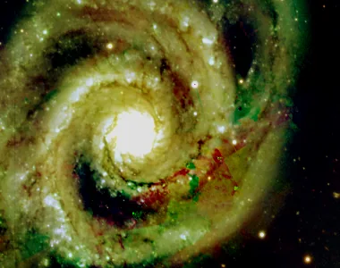

## Résumé

`Resample` change la taille de l'image selon un **facteur d'échelle continu** (`scale`), en
recalculant chaque pixel de sortie par **interpolation spline** de l'ordre choisi. Contrairement
à `IntegerResample`, qui ne gère que des facteurs entiers par binning/réplication, `Resample`
accepte n'importe quel facteur réel entre `0.01` et `20.0` — agrandissement ou réduction — et
lisse le résultat par un anti-aliasing automatique en cas de réduction.

*Un recadrage, et le même réduit au tiers. Posés côte à côte à la largeur de la page, le plus petit est réagrandi — ce qui est précisément ainsi qu'un sous-échantillonnage excessif se voit.*

## Cas d'usage

- **Réduire une image finale** avant export web ou partage (ex. `scale = 0.5`).
- **Uniformiser la résolution** de plusieurs images destinées à une mosaïque ou une combinaison
  LRGB dont les canaux n'ont pas le même échantillonnage.
- **Agrandir un recadré (crop)** pour inspecter finement une région (ex. cœur de galaxie) sans
  perdre en douceur d'interpolation.
- Adapter la taille d'une image de référence avant un traitement qui suppose des dimensions
  spécifiques (mesures, comparaison visuelle).

## Fonctionnement

Le process délègue tout le travail à `skimage.transform.resize` :

1. Les nouvelles dimensions sont calculées en arrondissant `hauteur × scale` et `largeur × scale`
   à l'entier le plus proche (minimum 1 pixel).
2. Si le facteur réduit la taille (`scale < 1.0`), un **filtre anti-aliasing** (lissage gaussien
   préalable) est appliqué automatiquement pour éviter le repliement de fréquence (moiré,
   crénelage) avant le sous-échantillonnage.
3. L'image est **interpolée par spline** d'ordre `order` sur la nouvelle grille de coordonnées,
   avec un mode de bord `reflect` (les pixels hors cadre sont extrapolés par symétrie miroir).
4. Le résultat est reconverti en `float32`.

L'opération change la géométrie de l'image (nouvelles dimensions) : `is_maskable = False`, un
masque de blend suppose une forme identique et ne s'applique donc pas ici.

## Mathématiques

Soit une image d'entrée de dimensions $(H, W)$ et un facteur d'échelle $\lambda$ = `scale`. Les
dimensions de sortie sont :

$$ H' = \max(1, \operatorname{round}(H\lambda)), \qquad W' = \max(1, \operatorname{round}(W\lambda)). $$

Pour chaque pixel de sortie $(i', j')$, on calcule la position correspondante dans le repère de
l'image d'entrée :

$$ (i, j) = \left(\frac{i' + 0{,}5}{H'/H} - 0{,}5,\; \frac{j' + 0{,}5}{W'/W} - 0{,}5\right), $$

puis on évalue en $(i, j)$ une **spline B** de degré `order` ($n \in \{0,\dots,5\}$) ajustée sur
la grille des pixels d'entrée :

- $n = 0$ : plus proche voisin (blocs francs, aucun flou).
- $n = 1$ : interpolation bilinéaire (par défaut).
- $n = 3$ : interpolation bicubique (lissage plus doux, léger surshoot possible).
- $n = 5$ : spline quintique (la plus lisse, la plus coûteuse).

Quand $\lambda < 1$, un pré-filtrage gaussien de largeur $\sigma \propto (1/\lambda - 1)$ est
appliqué avant l'échantillonnage : cela revient à convoluer l'image par un noyau passe-bas dont
la fréquence de coupure suit le théorème de Nyquist-Shannon pour la nouvelle grille, ce qui
supprime les composantes de fréquence supérieures à $1/(2\lambda)$ pixels$^{-1}$ et évite qu'elles
se replient en artefacts basse fréquence après sous-échantillonnage.

## Paramètres

- **`scale`** — *real*, défaut `0.5`, plage `0.01`–`20.0`. Facteur d'échelle appliqué aux deux
  dimensions : `< 1` réduit l'image, `> 1` l'agrandit, `1` la laisse inchangée (copie).
- **`order`** — *int*, défaut `1`, plage `0`–`5`. Ordre de la spline d'interpolation (0 = plus
  proche voisin, 1 = bilinéaire, 3 = bicubique, 5 = quintique). Un ordre plus élevé lisse
  davantage mais coûte plus cher et peut introduire un léger overshoot près des bords nets
  (étoiles, contours).

## Astuces & pièges

> **Attention** — les facteurs extrêmes (`scale` proche de `0.01` ou `20.0`) produisent des
> images minuscules ou énormes en mémoire ; vérifiez la taille résultante avant de traiter un
> lot entier.

- Pour un facteur **entier exact** (2×, 3×…), préférez `IntegerResample` : le binning moyenné
  (`downsample_op = "average"` ou `"sum"`) conserve mieux le bruit et le flux photométrique que
  l'interpolation spline générique de `Resample`.
- `order = 0` est utile pour rééchantillonner des **masques binaires** ou des cartes de défauts
  sans créer de valeurs intermédiaires non désirées.
- Un agrandissement (`scale > 1`) n'ajoute aucune information réelle : il ne remplace pas une
  vraie résolution supplémentaire (drizzle, super-résolution).

## Voir aussi

- [IntegerResample](retina-doc://IntegerResample) — binning/réplication par facteur entier, conserve le flux.
- [Crop](retina-doc://Crop) — recadrage sans changement d'échelle.
- [Rotation](retina-doc://Rotation) — rotation à angle quelconque, même famille d'interpolation.
- [PixelInterpolation](retina-doc://PixelInterpolation) — réglages d'interpolation partagés par les process géométriques.

## Références

- PixInsight — *Resample* tool reference.
- scikit-image — *skimage.transform.resize* (interpolation par spline, anti-aliasing).
