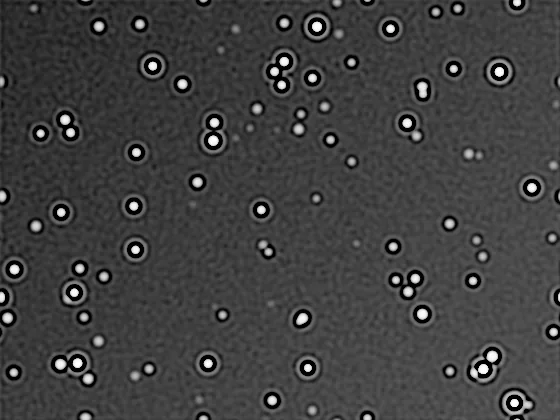

## Résumé

`RestorationFilter` restaure une image floutée par une PSF gaussienne connue à l'aide du
**filtre de Wiener**, une déconvolution **linéaire et directe** (pas d'itérations) réalisée
dans le domaine de Fourier. Contrairement à `Deconvolution` (Richardson-Lucy, itératif et
non-linéaire), ce filtre se calcule en une seule passe : il est donc nettement plus rapide,
au prix d'une modélisation plus simple du bruit. Le paramètre `balance` arbitre le compromis
netteté/bruit ; le mode `unsupervised` l'estime automatiquement par une approche bayésienne.

*Avant, et après une restauration de Wiener — directe, non itérative.*

## Cas d'usage

- **Correction rapide de flou de mise au point ou de turbulence** modélisable par une gaussienne,
  sur de grandes images où Richardson-Lucy serait trop lent.
- **Prétraitement avant un traitement itératif plus lourd** : un premier passage Wiener donne un
  résultat correct en une fraction du temps, pour juger si une déconvolution plus poussée est utile.
- **Cas où le niveau de bruit n'est pas bien connu** : le mode `unsupervised` évite de régler
  manuellement la régularisation par essais-erreurs.
- **Restauration légère avant `UnsharpMask`** pour ne pas amplifier le bruit d'une accentuation
  appliquée sur une image encore floue.

## Fonctionnement

Le process construit d'abord un **noyau PSF gaussien** de taille dérivée de `psf_sigma` (rayon
$\approx 3\sigma$, normalisé à somme unité) — c'est la même fonction `_gaussian_psf` que celle
utilisée par `Deconvolution`. Il traite ensuite chaque canal couleur indépendamment :

1. Les valeurs du canal sont bornées à `[0, 1]`.
2. Selon `mode` :
   - **`wiener`** — `skimage.restoration.wiener` applique le filtre de Wiener classique dans le
     domaine fréquentiel, régularisé par le paramètre `balance` (borne le bruit dans les hautes
     fréquences où la PSF atténue peu le signal).
   - **`unsupervised`** — `skimage.restoration.unsupervised_wiener` estime lui-même, par un
     algorithme bayésien itératif (échantillonnage de Gibbs), le niveau de régularisation optimal
     et le niveau de bruit ; aucun réglage manuel n'est nécessaire.
3. Le résultat est ré-écrêté à `[0, 1]` sur tous les canaux.

Comme `Deconvolution`, ce process suppose une PSF **gaussienne isotrope et spatialement
invariante** — une approximation raisonnable pour un léger défaut de focus ou de la turbulence
moyenne, mais pas pour une PSF réelle très asymétrique (coma, tilt de capteur).

## Mathématiques

Le modèle de dégradation est une convolution linéaire bruitée :

$$ g(x,y) = (h * f)(x,y) + n(x,y), $$

où $f$ est l'image nette recherchée, $h$ la PSF (noyau gaussien), et $n$ un bruit additif.
Dans le domaine de Fourier, avec $H$, $F$, $N$, $G$ les transformées respectives, le filtre de
Wiener estime $F$ par le filtre linéaire qui minimise l'erreur quadratique moyenne :

$$ \hat{F}(u,v) = \left[\frac{H^{*}(u,v)}{\,|H(u,v)|^{2} + K(u,v)\,}\right] G(u,v), $$

où $H^{*}$ est le conjugué de $H$ et $K$ le terme de **régularisation** — au sens strict,
$K = S_n / S_f$ (rapport des densités spectrales de puissance du bruit et du signal). En
pratique cette quantité est inconnue : le paramètre `balance` en tient lieu, avec une
régularisation de type Tikhonov (par défaut basée sur un opérateur laplacien plutôt qu'une
constante uniforme) qui pénalise davantage les hautes fréquences où le signal est le plus
noyé dans le bruit après division par $|H|^2$ (proche de zéro loin du centre de la PSF).

- `balance` **petit** ($\to 0$) : $\hat{F} \to G/H$, déconvolution **inverse pure** — netteté
  maximale mais amplification catastrophique du bruit.
- `balance` **grand** : $K$ domine devant $|H|^2$, $\hat{F} \to (H^{*}/K)\,G$, la correction
  s'atténue et le résultat se rapproche de l'image floue d'origine (comportement lisse et stable).

En mode `unsupervised`, $K$ (et le niveau de bruit) n'est pas fixé par l'utilisateur mais
**estimé conjointement avec l'image** par inférence bayésienne, en maximisant une vraisemblance
a posteriori sur un modèle hiérarchique (Orieux et al., 2010).

## Paramètres

- **`psf_sigma`** — *real*, défaut `2.0`, plage `0.1`–`20.0`. Écart-type (en pixels) de la PSF
  gaussienne supposée avoir dégradé l'image. Doit correspondre à l'étalement réel du flou :
  trop petit ne corrige rien, trop grand sur-corrige et fait apparaître des artefacts en anneaux.
- **`balance`** — *real*, défaut `0.1`, plage `0.0001`–`10.0`. Facteur de régularisation du
  filtre de Wiener (mode `wiener` uniquement). Petites valeurs → restauration agressive mais
  bruitée ; grandes valeurs → restauration douce et stable. Ignoré en mode `unsupervised`.
- **`mode`** — *enum*, défaut `wiener`, choix `wiener` / `unsupervised`. `wiener` utilise la
  régularisation manuelle `balance` ; `unsupervised` l'estime automatiquement par inférence
  bayésienne (plus lent, mais sans réglage à trouver).

## Astuces & pièges

> **Attention** — une PSF gaussienne est une approximation. Sur une PSF réelle fortement
> asymétrique (coma en bord de champ, étoiles allongées par un mauvais suivi), le filtre de
> Wiener isotrope laissera des résidus directionnels ; envisagez un recadrage par zone ou un
> outil de PSF non gaussienne si disponible.

- Commencez avec `balance` élevé (résultat doux) puis diminuez progressivement : le bruit
  amplifié apparaît souvent brutalement en dessous d'un certain seuil.
- Le mode `unsupervised` est un bon point de départ pour estimer un ordre de grandeur de
  `balance`, avant de repasser en mode `wiener` pour affiner manuellement.
- Comparé à `Deconvolution` (Richardson-Lucy), ce filtre ne préserve pas la positivité par
  construction pendant le calcul (d'où le clip final) et peut moins bien restituer les détails
  fins très contrastés ; réservez Richardson-Lucy quand la qualité prime sur la vitesse.
- Appliquez sur une image encore **linéaire** (avant étirement d'histogramme) : la déconvolution
  suppose un modèle de dégradation linéaire, faussé par une transformation de tons non linéaire.

## Voir aussi

- [Deconvolution](retina-doc://Deconvolution) — déconvolution itérative Richardson-Lucy (plus lente, souvent plus précise).
- [GaussianConvolution](retina-doc://GaussianConvolution) — opération inverse (floutage gaussien), utile pour tester la PSF.
- [NoiseReduction](retina-doc://NoiseReduction) — débruitage à combiner après une restauration agressive.
- [UnsharpMask](retina-doc://UnsharpMask) — accentuation locale de contraste, alternative légère à la déconvolution.

## Références

- scikit-image — *skimage.restoration.wiener* / *unsupervised_wiener*.
- Orieux, F., Giovannelli, J.-F., Rodet, T. (2010) — *Bayesian estimation of regularization and PSF parameters for Wiener-Hunt deconvolution*.
- Gonzalez, R. C., Woods, R. E. — *Digital Image Processing*, chap. Image Restoration (filtre de Wiener).
