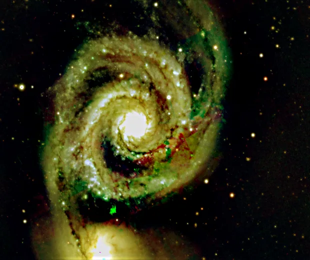

## Summary

`RickerWaveletEnhance` boosts structures whose size matches a **single scale**, set by
`width`, by convolving each channel with a **Ricker ("Mexican hat")** kernel, also known as
a Laplacian-of-Gaussian. Unlike a blur or a plain high-pass filter, this kernel is
**band-pass**: it responds strongly to structures close in size to `width`, and vanishes both
on a flat background and on very fine noise. It is a fast tool for pulling out diffuse
nebulosity and filaments without needing the full stack of scales of a wavelet transform.

*Before, and after enhancing structures three pixels wide.*

## Use cases

- **Reveal filaments or faint nebulosity** buried in a noisy sky background, by targeting
  their characteristic size through `width`.
- **Lightweight alternative to `MultiscaleLinearTransform`** when only a single scale needs
  attention, without decomposing and reconstructing the whole detail stack.
- **Local contrast enhancement** on extended structures (molecular clouds, supernova remnants)
  without amplifying pixel-level grain the way `UnsharpMask` would at a small radius.
- **Exploration**: sweep `width` to visually identify the scale at which a structure of
  interest stands out best, before refining with a full multiscale tool.

## How it works

For each color channel, the operator:

1. Builds a 2D Ricker kernel (`astropy.convolution.RickerWavelet2DKernel`) of width `width`,
   sized by default $\lfloor 8\cdot\text{width} + 1\rfloor$ pixels.
2. Convolves the image with that kernel **without renormalization**
   (`normalize_kernel=False`): since the kernel integrates to nearly zero, the convolution
   produces a **zero-centered detail map** — positive on structures of the matching size, near
   zero on flat background and on noise finer than `width`.
3. Adds that detail map back to the original image, weighted by `amount`, then clips the
   result to `[0, 1]`.

Because the kernel is radially symmetric and sums to zero, flat background regions are
barely affected: only the contrast of structures whose size is close to `width` gets
amplified, which sets this process apart from a plain high-pass filter or a broadband
sharpener.

## Mathematics

The 2D Ricker kernel (normalized Laplacian-of-Gaussian), with scale parameter
$\sigma = \texttt{width}$, is written in terms of the radius $r = \sqrt{x^2+y^2}$ from the
center:

$$ \psi_\sigma(x, y) = \frac{1}{\pi \sigma^4}\left(1 - \frac{r^2}{2\sigma^2}\right)
   \exp\!\left(-\frac{r^2}{2\sigma^2}\right) $$

It is, up to a factor, the second derivative (Laplacian) of a normalized Gaussian: positive
at the center, negative in a surrounding ring, and zero-integral over the plane
($\int\!\!\int \psi_\sigma = 0$). This property makes it a **band-pass filter**: its spatial
frequency response vanishes both at very low frequency (uniform background, slow gradients)
and at very high frequency (pixel-scale noise), peaking around the frequency associated with
$\sigma$.

The detail map is the convolution of the image $I$ with this kernel:

$$ D(x,y) = (I * \psi_\sigma)(x,y) $$

and the final per-channel result is:

$$ I'(x,y) = \operatorname{clip}\big(I(x,y) + a \cdot D(x,y),\; 0,\; 1\big), \qquad a = \texttt{amount} $$

Increasing `amount` amplifies the contrast of structures at scale $\sigma$; increasing
`width` shifts the targeted frequency band toward wider structures (at the cost of a kernel —
and thus a computation time — growing as $\sigma^2$).

## Parameters

- **`width`** — *real*, default `2.0`, range `0.5`–`50`. Scale width (σ) of the Ricker kernel,
  in pixels: sets the size of the enhanced structures. Small value → fine detail (tight
  filaments); large value → extended structures (broad nebulosity sheets), with a larger and
  more expensive kernel to convolve.
- **`amount`** — *real*, default `1.0`, range `0`–`10`. Weight applied when adding the detail
  map back to the original image. `0` = no effect; beyond `1` the enhancement becomes
  aggressive and can introduce halos or ringing artifacts around structures.

## Tips & pitfalls

> **Warning** — too high an `amount` combined with a small `width` produces **ringing**
> around stars and high-contrast edges, a typical signature of the Laplacian-of-Gaussian.
> Lower `amount` or protect stars with a mask before applying a strong enhancement.

- The kernel grows with `width` (size ≈ $8\sigma+1$): on large images, high `width` values
  can noticeably slow down processing.
- Since the response vanishes on fine noise, this process amplifies grain less than
  `UnsharpMask` at a small radius — prefer it when background noise becomes visible after
  sharpening.
- To enhance several scales at once (rather than a single band), use
  `MultiscaleLinearTransform` or `WaveletTransform` instead, which decompose the image into a
  full stack of layers.
- Work preferably on an already-stretched image, or one close to its final stretch: on very
  dark linear data, the visual effect of `amount` is hard to judge.

## See also

- [MultiscaleLinearTransform](retina-doc://MultiscaleLinearTransform) — full starlet wavelet
  decomposition, multi-layer enhancement.
- [WaveletTransform](retina-doc://WaveletTransform) — general wavelet transform.
- [UnsharpMask](retina-doc://UnsharpMask) — classic sharpening by subtracting a Gaussian blur.
- [LocalHistogramEqualization](retina-doc://LocalHistogramEqualization) — local contrast
  enhancement via adaptive equalization (CLAHE).

## References

- astropy.convolution — *RickerWavelet2DKernel* / *RickerWavelet2D* model.
- Marr, D. & Hildreth, E. (1980) — *Theory of edge detection* (Laplacian-of-Gaussian / Mexican hat).
- PixInsight — *ATrousWaveletTransform* (per-scale filtering, related principle).
