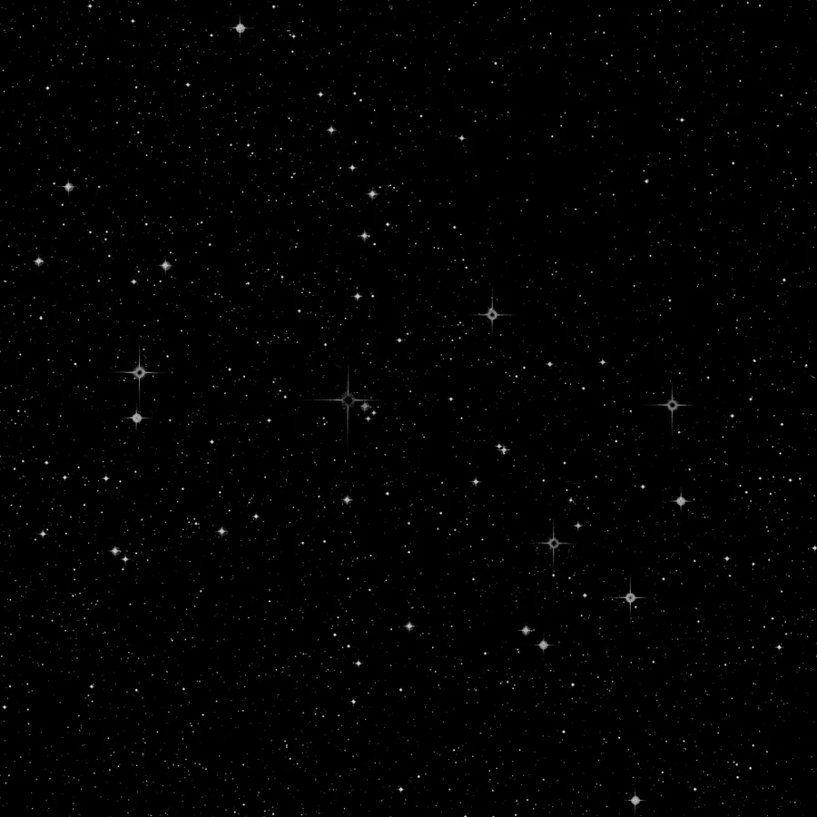

## Summary

`RollingBallBackground` estimates the **sky background** by virtually rolling a ball of radius
`radius` underneath the image's intensity surface (intensity acting as altitude). The height of
the ball's apex at each pixel gives the **background model**. It is a **fast** alternative to
[BackgroundExtraction](retina-doc://BackgroundExtraction): no box grid, no sigma-clipping — just
a classic morphological operation (Sternberg's method, popularized by ImageJ) — well suited to
previews and to fields where a single radius is enough to separate background from signal.

*Before, and after the rolling-ball background is removed, on the same real gradient `BackgroundExtraction` uses.*

## Use cases

- **Quickly flatten** a light-pollution gradient or residual vignetting, when speed matters more
  than the fine box-based control of `BackgroundExtraction`.
- **Preview** the effect of background extraction before tuning the more expensive parameters
  (`box_size`, robust estimator) of a slower method.
- Prepare a flat background before `BackgroundNeutralization` and color calibration, on fields
  without extended structures comparable in size to the ball.
- Isolate small bright structures (stars, point-like artifacts) by outputting the model alone
  (`subtract = False`) for inspection.

## How it works

Each channel is processed **independently**. The image is treated as a landscape whose altitude
is pixel intensity: a ball of radius `radius` (in pixels) is rolled underneath this landscape,
never crossing it. At each position `(x, y)`, the altitude of the ball's apex in contact with
the surface defines the background value `B(x, y)`. The computation (`skimage.restoration.
rolling_ball`) is **exact**, not a down-sampled approximation.

A direct consequence: any structure **narrower** than the ball (stars, point-like artifacts)
cannot push the ball upward — it is naturally excluded from the background model, with no need
to mask stars beforehand. Conversely, a structure **wider** than the radius (extended nebulosity,
galaxy core) is partly "swallowed" by the ball and disappears from the result when
`subtract = True`.

Depending on `subtract`, the output is either the image minus the background (`I - B`) or the
background model `B` itself, in both cases clipped to `[0, 1]`.

## Mathematics

Let $I(x,y)$ be the intensity (the "altitude") and $R$ = `radius`. The ball of radius $R$ defines
a spherical kernel:

$$ K_R(u,v) = \sqrt{R^2 - u^2 - v^2}, \qquad u^2 + v^2 \le R^2. $$

Rolling this ball under $I$ is equivalent to a **grayscale morphological opening** by the
non-flat kernel $K_R$, i.e. an erosion followed by a dilation:

$$ E(x,y) = \min_{u^2+v^2 \le R^2} \big[\, I(x+u,\,y+v) - K_R(u,v) \,\big] $$

$$ B(x,y) = \max_{u^2+v^2 \le R^2} \big[\, E(x+u,\,y+v) + K_R(u,v) \,\big] $$

$B$ is the **background model**. The process output is:

$$ I'(x,y) = \operatorname{clip}\!\big(I(x,y) - B(x,y),\; 0,\; 1\big) \quad \text{if } \texttt{subtract} = \text{True}, $$
$$ I'(x,y) = \operatorname{clip}\!\big(B(x,y),\; 0,\; 1\big) \quad \text{otherwise.} $$

The algorithm's complexity is **polynomial in $R$** (degree equal to the spatial dimension, so
$O(R^2)$ per pixel in 2D): a large radius on a large image can become expensive.

## Parameters

- **`radius`** — *real*, default `50.0`, range `1.0`–`2000.0`. Radius (in pixels) of the ball
  rolled under the intensity surface. Sets the spatial scale separating background from signal:
  any structure narrower than the ball is treated as noise/point signal and excluded from the
  background; any structure wider is absorbed into the background. Too small a radius eats into
  extended nebulosity; too large a radius misses small-scale gradients and slows the computation
  significantly (complexity polynomial in `radius`).
- **`subtract`** — *bool*, default `True`. If True, subtracts the background model from the
  image (`I - B`, clipped). If False, outputs the estimated background model `B` directly,
  useful to check that it holds no real signal before applying it.

## Tips & pitfalls

> **Warning** — unlike `BackgroundExtraction` (which uses box-wise sigma-clipping), this method
> has **no statistical knowledge** of noise: it relies purely on the geometry of the intensity
> landscape. On a very noisy image, a light Gaussian smoothing before extraction improves the
> stability of the model.

- Start by outputting the model alone (`subtract = False`) to visually check it does not bite
  into extended nebulosity or a galaxy core.
- The radius must remain **clearly larger** than the apparent diameter of the widest stars,
  otherwise dark halos appear around them after subtraction.
- On a wide field with a complex gradient (several light-pollution sources), prefer
  `BackgroundExtraction` (box grid + robust estimator) or
  [DynamicBackgroundExtraction](retina-doc://DynamicBackgroundExtraction) (manual sample points),
  which are more flexible than a single radius.
- Per-channel processing can slightly shift the color balance if the background differs between
  channels; check the result with `BackgroundNeutralization` afterward.

## See also

- [BackgroundExtraction](retina-doc://BackgroundExtraction) — background extraction via a robust box grid (≈ABE), finer but slower.
- [DynamicBackgroundExtraction](retina-doc://DynamicBackgroundExtraction) — background from manually chosen points (≈DBE).
- [BackgroundNeutralization](retina-doc://BackgroundNeutralization) — colorimetric background neutralization once flattened.
- [GradientCorrection](retina-doc://GradientCorrection) — global gradient removal.

## References

- Sternberg, S. R. — *Biomedical Image Processing*, Computer 16(1), 1983 (rolling-ball algorithm).
- scikit-image — documentation for `skimage.restoration.rolling_ball`.
- PixInsight — *AutomaticBackgroundExtractor* (comparison tool).
