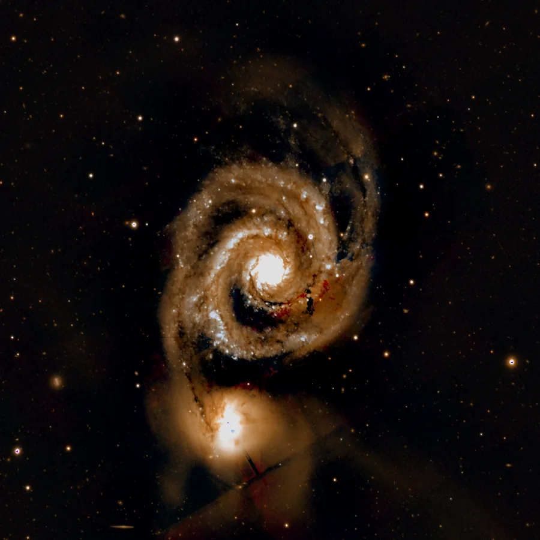

## Summary

`SCNR` (*Subtractive Chromatic Noise Reduction*) corrects an **excessive color cast on one
channel**, typically the green produced by color CMOS/CCD sensors or by combining narrowband
filters. Rather than desaturating the whole image, the algorithm **caps** the target channel
with a "neutral" reference computed from the two other channels, preserving stars and natural
hues elsewhere in the image.

*Before, and after green removal. The cast is genuine: the source is an uncalibrated three-band composite.*

## Use cases

- **Remove the green cast** typical of Bayer sensors after debayering or of a poorly balanced
  RGB combination.
- **Compose a bicolor/tricolor narrowband image** (SHO, HOO) where the Hα or OIII channel
  spills into green over nebulae.
- **Clean up channel artifacts** before `ColorCalibration` or `PhotometricColorCalibration`, so
  the calibration isn't skewed by a spurious hue.
- **Neutralize a residual gradient** tinted on a single channel, as a complement to
  `BackgroundNeutralization`.

## How it works

For each pixel, the algorithm computes a **neutral reference value** from the two non-targeted
channels (`channel` designates the channel to treat, default `G`):

- `protection = "average"`: the average of the two other channels — gentle protection, close to
  Photoshop's historical behavior.
- `protection = "maximum"`: the maximum of the two other channels — more aggressive protection,
  identical to PixInsight's "Maximum Mask" mode.

The target channel is then **clipped** to this neutral reference wherever it exceeds it (this
is the "subtractive" part: the channel can only be reduced, never increased). The `amount`
parameter then interpolates between the original image and this corrected version, to dial in
the strength of the effect. Images with fewer than three channels (mono) are returned
unchanged.

## Mathematics

Let a pixel have components $(r, g, b) \in [0,1]^3$, and let $t$ be the component of the
targeted channel (`channel`), $u, v$ the two other components. The neutral reference $n$ is:

$$
n =
\begin{cases}
\dfrac{u + v}{2} & \text{if } \texttt{protection} = \text{average} \\[6pt]
\max(u, v) & \text{if } \texttt{protection} = \text{maximum}
\end{cases}
$$

The capped value (the "pure subtractive" component) is:

$$ t_{\text{cap}} = \min(t, n) $$

and the final output blends the original and the capped version according to
`amount` $\in [0,1]$:

$$ t' = t + \texttt{amount} \cdot (t_{\text{cap}} - t) = (1-\texttt{amount})\,t + \texttt{amount}\,t_{\text{cap}} $$

Since $t_{\text{cap}} \le t$ by construction, we always have $t' \le t$: the channel can only be
reduced, never amplified — hence the name "subtractive". With `amount = 1`,
$t' = \min(t, n)$ (full SCNR); with `amount = 0`, the image is unchanged. The two other
channels $u, v$ are never modified. The result is finally clipped to $[0,1]$.

## Parameters

- **`channel`** — *enum*, default `G`, choices `R`, `G`, `B`. Channel to correct. `G` (green) is
  by far the most common case (green cast of color sensors), but `R` or `B` can be used for
  other channel artifacts.
- **`protection`** — *enum*, default `average`, choices `average`, `maximum`. Method used to
  compute the neutral reference from the two other channels: `average` (gentle protection) or
  `maximum` (aggressive protection, clips more).
- **`amount`** — *real*, default `1.0`, range `0`–`1`. Strength of the blend between the
  original image and the capped version. `1.0` = full SCNR; intermediate values give a partial
  effect that attenuates the cast without fully removing it.

## Tips & pitfalls

> **Warning** — on a narrowband image where the targeted channel carries real signal
> (e.g. OIII mapped to green in a non-Hubble palette), an `amount = 1.0` SCNR can remove real
> detail, not just a cast. Reduce `amount` or work under a protection mask.

- Apply `SCNR` **before** stretching: on a linear image the cast is easier to correct cleanly
  than after a strong non-linear stretch.
- `protection = "maximum"` treats more aggressively pixels where only one of the two other
  channels is strong (e.g. saturated blue or red stars); prefer `average` if this produces
  halos or dull hues on stars.
- An `amount` around `0.5`–`0.8` often gives a more natural result than a full SCNR, especially
  on classic color (RGB) images rather than narrowband.

## See also

- [ColorSaturation](retina-doc://ColorSaturation) — global saturation adjustment, for
  complementary color control.
- [BackgroundNeutralization](retina-doc://BackgroundNeutralization) — neutralizes the sky
  background hue rather than a whole channel.
- [ColorCalibration](retina-doc://ColorCalibration) — global color calibration, typically
  applied after SCNR.
- [PhotometricColorCalibration](retina-doc://PhotometricColorCalibration) — catalog-based color
  calibration, sensitive to residual casts.

## References

- PixInsight — *SCNR (Subtractive Chromatic Noise Reduction)* tool reference.
- Rusnak, T. — *Subtractive Chromatic Noise Reduction*, original PixInsight forum algorithm.
