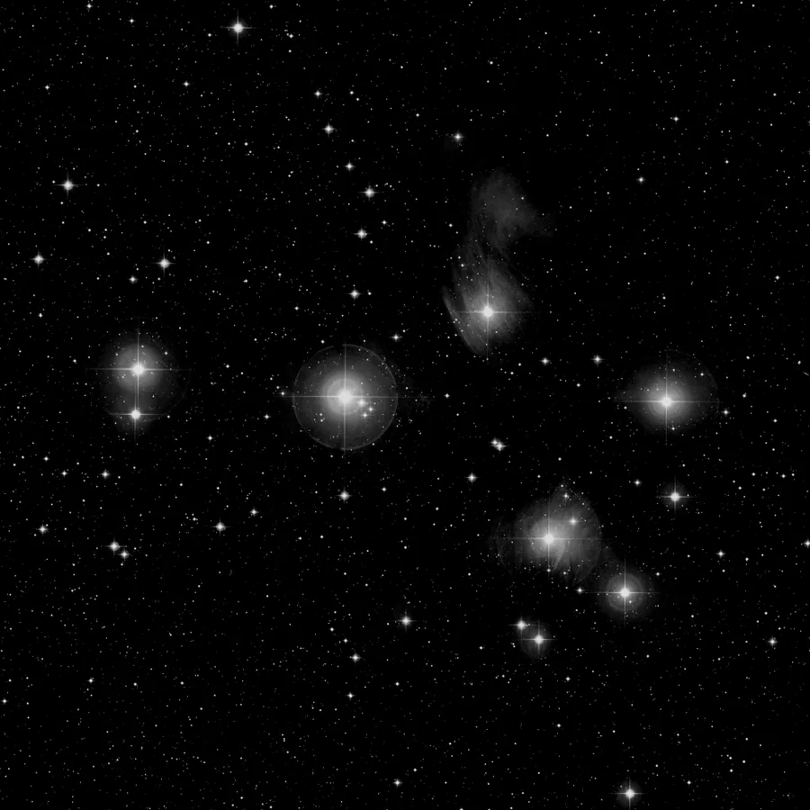

## Résumé

`SEPBackground` modélise le **fond de ciel** (pollution lumineuse, vignetage résiduel, halo
lunaire) en s'appuyant sur `sep`, le portage Python/C de l'algorithme de fond de **SExtractor**.
C'est l'alternative très rapide à `BackgroundExtraction` (basé sur `photutils`) : même principe
de grille robuste aux étoiles, mais implémentation en C bien plus légère, particulièrement
avantageuse sur les grands champs ou en traitement par lot.

*Avant, et après soustraction du modèle de fond `sep`, sur le gradient réel qu'utilise `BackgroundExtraction`.*

## Cas d'usage

- **Aplatir un gradient** de pollution lumineuse ou de lune sur un champ large, avec un budget
  temps serré (traitement par lot, prévisualisation rapide).
- **Corriger un vignetage résiduel** mal calibré par les flats.
- **Extraire le modèle de fond seul** (`subtract=False`) pour l'inspecter avant de le réinjecter
  ailleurs (ex. `PixelMath`) ou pour alimenter `SEPSourceExtraction`, qui utilise le même moteur.

## Fonctionnement

L'image est découpée en une grille de boîtes carrées de côté `box_size`. Dans chaque boîte, `sep`
calcule une statistique de fond **résistante aux sources** après rejet sigma itératif des pixels
brillants (étoiles, artefacts). Cette estimation par boîte est ensuite lissée par un **filtre
médian** glissant de taille `filter_size` (exprimée en nombre de boîtes voisines), qui élimine les
suréstimations locales isolées dues à un objet étendu tombé dans une seule boîte. La grille lissée
est enfin **interpolée** (spline bicubique) pour produire une surface de fond continue à la
résolution complète de l'image. Le process traite chaque canal indépendamment et, selon
`subtract`, soustrait cette surface de l'image d'origine ou la restitue telle quelle comme sortie.

## Mathématiques

Sur chaque boîte $b$ de la grille, après rejet sigma itératif des pixels aberrants (étoiles),
`sep` reprend l'estimateur de mode de SExtractor, combinaison de la médiane et de la moyenne
robustes :

$$ \mu_b = 2{,}5\,\operatorname{med}_b - 1{,}5\,\overline{x}_b $$

approximation valable quand la distribution des pixels de fond (hors sources) reste proche d'une
gaussienne légèrement asymétrique. La grille $\{\mu_b\}$ est ensuite lissée par un filtre médian
de fenêtre `filter_size` × `filter_size` (en unités de boîtes) :

$$ \tilde{\mu}_b = \operatorname{med}\big(\{\mu_{b'} : b' \in \mathcal{N}_\text{filter\_size}(b)\}\big), $$

puis interpolée par spline bicubique pour obtenir la surface de fond continue $B(x,y)$ à la
résolution image. La sortie est :

$$ I'(x,y) = I(x,y) - B(x,y) \quad\text{si `subtract=True`,} \qquad I'(x,y) = B(x,y) \quad\text{sinon,} $$

le résultat étant enfin écrêté dans $[0,1]$. Aucun pedestal n'est ajouté après soustraction :
contrairement à `BackgroundExtraction`, `SEPBackground` ne compense pas les valeurs négatives
introduites par la soustraction.

## Paramètres

- **`box_size`** — *int*, défaut `64`, plage `4`–`1024`. Taille de boîte (en pixels) de la grille
  d'estimation. Une valeur élevée donne un fond très lisse (bon pour les gradients larges) ; une
  valeur faible suit les variations fines, au risque d'absorber de la nébulosité étendue.
- **`filter_size`** — *int*, défaut `3`, plage `1`–`15`. Taille (en nombre de boîtes voisines) du
  filtre médian appliqué à la grille de fond avant interpolation. Augmenter cette valeur lisse
  davantage la surface de fond et atténue les artefacts dus à des boîtes isolées polluées par une
  source étendue.
- **`subtract`** — *bool*, défaut `True`. Si vrai, soustrait le modèle de fond de l'image ; sinon,
  sort le modèle de fond seul (utile pour inspection ou diagnostic).

## Astuces & pièges

> **Attention** — comme pour tout estimateur de fond par grille, un `box_size` trop petit modélise
> la nébulosité étendue comme du fond et l'absorbe avec lui. Sur un objet diffus qui occupe une
> large part du champ, augmentez `box_size` ou protégez la zone avec un masque.

> **Note** — la soustraction ne réinjecte **aucun pedestal** : sur une image déjà proche de zéro,
> elle peut créer des valeurs négatives, écrêtées à 0 par le process. Vérifiez le fond résultant
> avant l'étirement.

- Sortez d'abord le modèle seul (`subtract=False`) pour vérifier visuellement qu'il ne contient
  pas de signal réel avant de l'appliquer définitivement.
- Sur un champ standard (< 4000 px de côté), `SEPBackground` et `BackgroundExtraction` donnent des
  résultats très proches ; préférez `SEPBackground` quand la vitesse prime (mosaïques, batch).
- `SEPSourceExtraction` réutilise le même moteur `sep` pour la détection de sources : les deux
  process partagent la même vision du fond de ciel.

## Voir aussi

- [BackgroundExtraction](retina-doc://BackgroundExtraction) — équivalent basé sur `photutils`, avec pedestal et choix d'estimateur.
- [RollingBallBackground](retina-doc://RollingBallBackground) — modélisation de fond par boule roulante (morphologique).
- [SEPSourceExtraction](retina-doc://SEPSourceExtraction) — détection de sources avec le même moteur `sep`.
- [BackgroundNeutralization](retina-doc://BackgroundNeutralization) — neutralisation colorimétrique du fond, étape suivante typique.

## Références

- Bertin, E. & Arnouts, S. — *SExtractor: Software for source extraction* (1996).
- Barbary, K. — *sep*: Python and C library for Source Extraction and Photometry.
