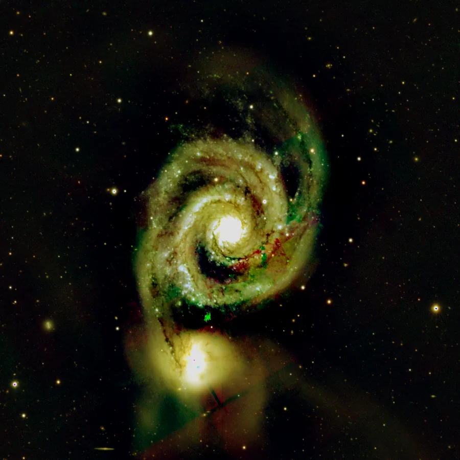
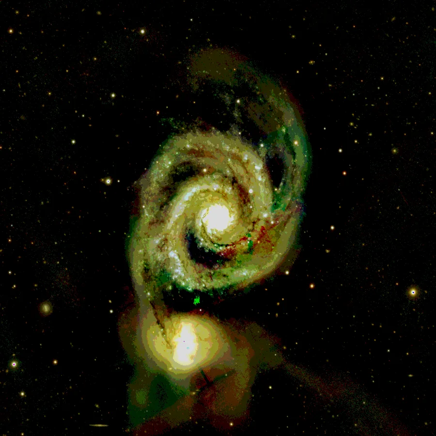

## Résumé

`SampleFormatConversion` simule l'effet d'un **enregistrement en entier N bits** (8, 16 ou
32) sur les valeurs de pixels, sans jamais changer le type de stockage réel de l'image : en
interne, Retina travaille toujours en `float32`. Le process **arrondit** chaque échantillon
au niveau de quantification le plus proche pour un format à `bits` bits par canal, puis le
renormalise dans `[0, 1]`. C'est l'équivalent pédagogique/diagnostic du `SampleFormatConversion`
de PixInsight, utile pour **prévisualiser la perte de précision** avant un export en TIFF/FITS
entier, ou pour reproduire volontairement du banding dans un test.

*Avant, et après quantification sur trois bits. Une vraie conversion en utilise seize, où l'écart passe sous ce qu'un écran montre ; le banding ici est le même effet, grossi assez pour être regardé.*

## Cas d'usage

- **Anticiper un export 8 ou 16 bits** : voir apparaître le banding (contours en marches
  d'escalier) qu'un enregistrement en entier introduirait sur un dégradé de fond de ciel très
  étiré, avant de committer réellement ce choix à la sauvegarde.
- **Diagnostiquer une perte de précision** déjà survenue sur un fichier acquis/converti en
  entier, en reproduisant l'artefact pour la comparer visuellement à la version 32 bits flottant.
- **Test/pédagogie** : illustrer la différence entre profondeur de bits et dynamique réelle du
  capteur, ou générer des données synthétiques quantifiées pour des tests unitaires.

## Fonctionnement

Le paramètre `bits` sélectionne un nombre de niveaux de quantification $L = 2^{\text{bits}}$.
Pour `bits = 32`, le process est un **passe-plat** : les données `float32` sont recopiées telles
quelles (32 bits flottants ne sont pas quantifiés ici, la profondeur native est déjà supérieure
à ce qu'un entier 32 bits apporterait en pratique pour de l'image). Pour `8` ou `16` bits, chaque
échantillon est :

1. **écrêté** dans `[0, 1]` (l'espace de travail normalisé de Retina) ;
2. **multiplié** par le nombre de paliers disponibles ($2^{\text{bits}} - 1$) puis **arrondi** à
   l'entier le plus proche — ce qui simule le stockage sur un entier non signé à `bits` bits ;
3. **redivisé** par le même facteur pour revenir dans `[0, 1]`, où le résultat est reconverti et
   stocké en `float32`.

L'image reste donc manipulable comme n'importe quelle image flottante de Retina (chaînable,
maskable), mais ses valeurs ne peuvent plus prendre que $2^{\text{bits}}$ niveaux distincts par
canal — exactement l'effet qu'aurait un enregistrement réel en entier `bits` bits.

## Mathématiques

Soit $x \in [0,1]$ la valeur d'un échantillon et $b$ = `bits`. Le nombre de niveaux représentables
et le pas de quantification associés valent :

$$ L = 2^{b} - 1, \qquad \Delta = \frac{1}{L}. $$

La sortie quantifiée est :

$$ q(x) = \frac{1}{L}\,\operatorname{round}\!\big(L \cdot \operatorname{clip}(x, 0, 1)\big). $$

Le bruit de quantification introduit, en supposant une erreur uniforme sur $[-\Delta/2, \Delta/2]$,
a une variance théorique de :

$$ \sigma_q^2 = \frac{\Delta^2}{12} = \frac{1}{12\,(2^{b}-1)^2}. $$

À `bits = 8`, $\Delta \approx 1/255$ et $\sigma_q \approx 1{,}1\times10^{-3}$ — largement visible
sous forme de marches sur un dégradé lisse fortement étiré. À `bits = 16`, $\Delta \approx
1/65535$ et $\sigma_q \approx 4{,}4\times10^{-6}$, en général bien en dessous du bruit de photon
du capteur et donc invisible en pratique.

## Paramètres

- **`bits`** — *enum*, défaut `16`, choix : `8`, `16`, `32`. Profondeur de bits par canal simulée.
  `8` et `16` appliquent la quantification décrite ci-dessus ; `32` laisse les données `float32`
  inchangées (copie simple).

## Astuces & pièges

> **Attention** — cette opération est **destructive** : les niveaux intermédiaires perdus par
> l'arrondi ne sont pas récupérables (hors annulation via l'historique de la vue). Ne l'appliquez
> pas trop tôt dans un pipeline de traitement linéaire, sous peine d'amplifier le banding lors
> d'étirements ultérieurs agressifs.

- Le banding introduit par une quantification 8 bits est fortement amplifié par
  `HistogramTransformation` ou tout étirement non linéaire appliqué après coup : testez toujours
  la quantification **après** l'étirement final, pas avant.
- Pour vérifier objectivement l'effet, comparez les statistiques (`Statistics`) avant/après : le
  nombre de valeurs uniques par canal chute à $2^{\text{bits}}$ au maximum.
- Ce process ne remplace pas le choix du format d'export réel (TIFF 8/16 bits, FITS entier) : il
  ne fait que **prévisualiser** l'effet en gardant l'image en `float32` exploitable dans Retina.

## Voir aussi

- [Rescale](retina-doc://Rescale) — renormalise la plage dynamique avant quantification.
- [Binarize](retina-doc://Binarize) — cas extrême de quantification à 1 bit (seuillage).
- [Statistics](retina-doc://Statistics) — mesurer l'effet du bruit de quantification introduit.
- [HistogramTransformation](retina-doc://HistogramTransformation) — l'étirement qui révèle le banding.

## Références

- PixInsight — *SampleFormatConversion* process reference.
- Numpy — *numpy.rint* / quantification uniforme d'un signal.
