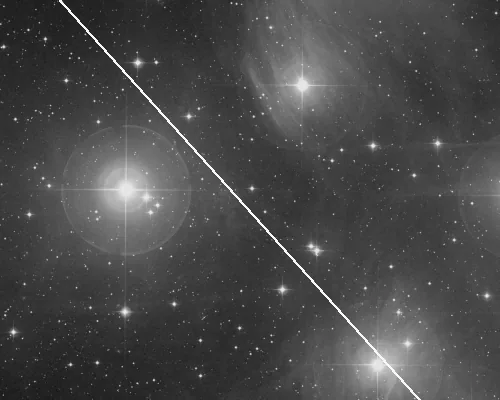
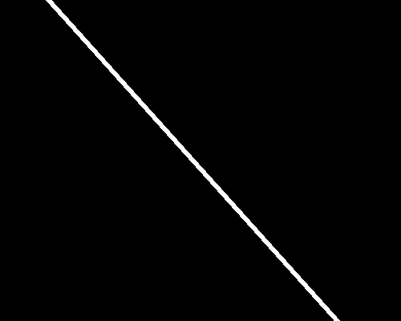

## Résumé

`SatelliteTrailDetection` repère automatiquement la **traînée linéaire** laissée par un
satellite ou un avion sur une pose (un segment fin, à peu près rectiligne, traversant tout
ou partie du champ) et en produit un **masque** binaire dans une nouvelle fenêtre. La
détection s'appuie sur la **transformée de Radon** : toute droite dans l'image y forme un
pic ponctuel unique, ce qui rend le repérage robuste même sur une traînée de faible
contraste noyée dans le fond de ciel et les étoiles. C'est un process de génération de
masque (comme `StarMask` ou `RangeSelection`) : non destructif, il ne modifie pas la vue
source et n'est lui-même pas maskable.

*Une pose traversée par une traînée, et le masque que le process rend. La traînée est injectée.*

## Cas d'usage

- **Repérer automatiquement** une traînée de satellite Starlink ou d'avion sur une pose
  unique, sans devoir la pointer manuellement.
- **Générer un masque** pour ensuite effacer la traînée avec `Inpaint` (reconstruction du
  fond sous le masque) sans affecter le reste de l'image.
- **Diagnostiquer une pose suspecte** avant intégration : si `.angle_deg` révèle une droite
  nette, la frame est probablement contaminée et peut être exclue ou nettoyée avant
  `Integration`.
- Alternative ciblée à `CosmicClip`/au rejet sigma d'intégration lorsque l'intrus est un
  segment continu plutôt qu'un impact ponctuel de rayon cosmique.

## Fonctionnement

1. **Isolement des hautes fréquences** : la luminance est comparée à sa version filtrée par
   un filtre médian (fenêtre 5×5), et seul le résidu positif est conservé
   (`clip(lum − médiane_locale, 0, ∞)`). Cela atténue le fond de ciel et les structures
   lisses (nébulosité, gradient) tout en préservant les bords fins et contrastés — dont la
   traînée, qui est justement une structure étroite et localement plus brillante que son
   voisinage.
2. **Transformée de Radon** de ce résidu sur 180 angles régulièrement espacés dans
   `[0°, 180°)`. Une droite de l'image produit dans le sinogramme un **pic unique** en
   `(rho, theta)`, d'autant plus marqué que la traînée est longue, fine et contrastée.
3. **Repérage du pic** : l'indice `(r0, t0)` du maximum du sinogramme donne l'angle détecté,
   stocké dans l'attribut `angle_deg` de l'instance après exécution.
4. **Rétroprojection non filtrée** d'un sinogramme ne contenant que ce pic isolé (tout le
   reste à zéro). Par dualité point↔droite, rétroprojeter un point unique du sinogramme
   retrace exactement la droite correspondante dans le plan image — c'est le mécanisme clé
   de l'algorithme.
5. **Recadrage** de la reconstruction (dimensionnée sur la diagonale de l'image par `radon`)
   au format `(h, w)` d'origine, puis **seuillage** relatif au maximum reconstruit
   (`threshold`) pour obtenir un masque binaire de la droite.
6. **Épaississement** du masque par dilatation binaire sur `width` itérations, pour couvrir
   la largeur réelle de la traînée (qui n'est jamais parfaitement fine à l'échelle du pixel).

## Mathématiques

La **transformée de Radon** d'une image $f(x,y)$ intègre les valeurs le long de toutes les
droites du plan, paramétrées par leur distance à l'origine $\rho$ et leur orientation
normale $\theta$ :

$$ R_\theta(\rho) = \int\!\!\int f(x,y)\,
   \delta\big(\rho - x\cos\theta - y\sin\theta\big)\, dx\, dy . $$

Une **droite** dans $f$ (bord net, traînée) concentre son énergie sur un couple $(\rho_0,
\theta_0)$ unique : elle apparaît dans le sinogramme $R_\theta(\rho)$ comme un **pic
localisé**, repéré ici par $(r_0, t_0) = \arg\max R_\theta(\rho)$.

La **rétroprojection non filtrée** (utilisée sans filtre rampe, `filter_name=None`) reconstruit
l'espace image en intégrant le sinogramme sur tous les angles :

$$ b(x, y) = \int_0^{\pi} p\big(x\cos\theta + y\sin\theta,\ \theta\big)\, d\theta . $$

Lorsque $p$ est nul partout sauf au point isolé $(\rho_0, \theta_0)$, cette intégrale ne
contribue que pour les pixels $(x, y)$ vérifiant exactement l'équation de la droite normale :

$$ x\cos\theta_0 + y\sin\theta_0 = \rho_0 , $$

et $b(x,y)$ est nul ailleurs. C'est la **dualité point↔droite** de la transformée de Radon :
rétroprojeter un unique point du sinogramme redessine, dans le plan image, exactement la
droite dont il est issu. Le masque final s'obtient par seuillage relatif au pic reconstruit
$b_{\max}$ :

$$ M(x,y) = \mathbb{1}\big[\, b(x,y) \ge \texttt{threshold} \cdot b_{\max} \,\big], $$

puis dilatation morphologique sur `width` itérations pour donner à la droite idéalement fine
une épaisseur représentative de la traînée réelle.

## Paramètres

- **`threshold`** — *real*, défaut `0.5`, plage `0.05`–`0.99`. Fraction du pic de
  rétroprojection au-delà de laquelle un pixel appartient au masque de la droite. Une valeur
  basse élargit le masque le long de la reconstruction (plus permissif), une valeur haute le
  resserre au voisinage immédiat du pic.
- **`width`** — *int*, défaut `2`, plage `0`–`30`. Nombre d'itérations de dilatation binaire
  appliquées au masque de droite obtenu par seuillage, pour approcher l'épaisseur réelle
  (en pixels) de la traînée. `0` désactive la dilatation.

## Astuces & pièges

> **Attention** — l'algorithme suppose **une seule traînée dominante** par image : s'il y en
> a plusieurs, seul le pic le plus fort du sinogramme est détecté, les autres sont ignorés.
> Il faut alors ré-exécuter le process après avoir masqué/traité la première traînée.

> **Note** — l'étape de filtrage passe-haut réagit à *tout* contraste fin et rectiligne : une
> arête de vignettage résiduel, un artefact de capteur en ligne droite ou une aigrette
> d'étoile brillante peuvent, dans de rares cas, dominer le sinogramme à la place d'une vraie
> traînée. Vérifiez visuellement le masque produit avant de l'utiliser pour un inpainting.

- Le résultat est une **nouvelle fenêtre** (masque monocanal) : le process ne modifie jamais
  la vue source, conformément aux autres générateurs de masque (`StarMask`, `RangeSelection`).
- L'angle détecté (`angle_deg`, en degrés, convention de `radon`) est accessible après
  exécution sur l'instance du process — utile pour journaliser ou filtrer automatiquement des
  poses contaminées avant intégration.
- Sur un champ pauvre en étoiles brillantes et sans gradient marqué, le filtre passe-haut
  isole la traînée très proprement ; sur un champ riche en aigrettes de diffraction, un
  `RangeSelection` ou un masque d'étoiles préalable peut aider à nettoyer l'entrée.

## Voir aussi

- [StarMask](retina-doc://StarMask) — masque d'étoiles, même famille de génération de masque.
- [RangeSelection](retina-doc://RangeSelection) — masque par plage d'intensité, alternative simple.
- [CosmicClip](retina-doc://CosmicClip) — rejet des impacts de rayons cosmiques (intrus ponctuels).
- [Inpaint](retina-doc://Inpaint) — reconstruction du fond sous un masque, pour effacer la traînée détectée.

## Références

- Radon, J. (1917) — *Über die Bestimmung von Funktionen durch ihre Integralwerte längs
  gewisser Mannigfaltigkeiten*.
- scikit-image — *skimage.transform.radon / iradon* (transformée de Radon et inverse).
