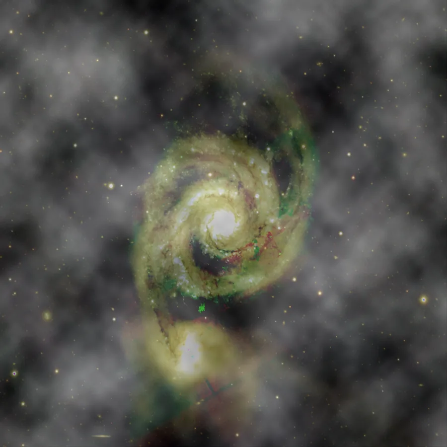

## Résumé

`SimplexNoise` synthétise un champ de bruit **fractal et lisse** en sommant plusieurs
**octaves** de bruit de valeur, chacune à une fréquence spatiale double de la précédente et
d'amplitude moitié moindre, puis mélange ce champ avec l'image selon un poids `amount`. Le nom
fait référence au bruit simplex de PixInsight, mais l'implémentation de Retina en est une
**approximation sans dépendance** : au lieu d'un vrai bruit simplex (grille simpliciale de
Perlin), elle interpole par spline une grille aléatoire grossière — un *value noise* classique
— ce qui produit un résultat visuellement très proche (texture organique, sans direction
privilégiée) pour un coût d'implémentation minimal.

*Avant, et après ajout d'un bruit simplex cohérent — celui qui modélise un gradient de ciel plutôt que le grain du capteur.*

## Cas d'usage

- **Tester un pipeline de débruitage** : injecter un bruit synthétique contrôlé pour comparer
  `NoiseReduction`, `WaveletDenoise` ou `FastNLMeansDenoise` sur un signal connu.
- **Simuler des frames** pour valider un script de calibration/intégration sans matériel.
- **Générer des textures de fond** (nuages, fumée, artefacts organiques) pour des compositions
  ou des masques synthétiques.
- **Perturber légèrement** une image trop lisse (issue d'un rendu ou d'un stacking très profond)
  afin d'éviter le banding lors d'un étirement ultérieur.

## Fonctionnement

1. Pour chaque octave $o$ (de `0` à `octaves - 1`), une grille aléatoire grossière de
   $\texttt{scale} \cdot 2^o$ cellules par côté est tirée (`numpy.random.default_rng(seed)`),
   puis interpolée par spline cubique (`scipy.ndimage.zoom`, ordre 3) jusqu'à la taille pleine
   de l'image. Doubler la fréquence à chaque octave ajoute du détail fin progressivement.
2. Les octaves sont sommées avec une **amplitude décroissante** (facteur `0.5` par octave,
   *persistance* fractale classique), puis la somme est normalisée par le poids total accumulé.
3. Le champ résultant est **renormalisé linéairement** dans `[0, 1]` (min → 0, max → 1) afin
   d'utiliser toute la plage dynamique quel que soit le nombre d'octaves.
4. Le champ de bruit (répliqué sur tous les canaux) est **mélangé** avec l'image d'entrée selon
   le poids `amount`, puis le résultat est écrêté dans `[0, 1]`.

> **Note** — ce n'est pas un bruit *additif* au sens strict : à `amount = 1.0`, l'image
> d'origine est entièrement **remplacée** par le champ de bruit. Pour un ajout discret, utilisez
> une petite valeur d'`amount`.

## Mathématiques

Soit $c_o$ une grille aléatoire uniforme $\mathcal{U}(0,1)$ de résolution
$\texttt{scale}\cdot 2^{o}$, interpolée par spline cubique en un champ plein cadre
$N_o(x,y)$. Le champ fractal brut est la somme pondérée sur les $O$ = `octaves` :

$$ F(x,y) = \frac{1}{\sum_{o=0}^{O-1} 2^{-o}} \sum_{o=0}^{O-1} 2^{-o}\, N_o(x,y) $$

C'est un bruit à **1/f approximatif** : chaque octave double la fréquence spatiale
(détail plus fin) tandis que son amplitude est divisée par deux, ce qui est le schéma de
construction classique du bruit fractal (fBm / Perlin multi-octaves). Le champ est ensuite
renormalisé sur toute la plage observée :

$$ \hat F(x,y) = \frac{F(x,y) - \min F}{\max F - \min F} $$

et mélangé linéairement à l'image $I$ avec le poids $a$ = `amount` :

$$ I'(x,y,c) = (1-a)\, I(x,y,c) + a\, \hat F(x,y), \qquad I' \leftarrow \operatorname{clip}(I', 0, 1) $$

le même champ $\hat F$ étant appliqué identiquement à tous les canaux $c$ (bruit achromatique).

## Paramètres

- **`octaves`** — *int*, défaut `4`, plage `1`–`8`. Nombre de couches de bruit sommées. Plus
  d'octaves ajoutent du détail fin (texture plus riche) au prix d'un calcul plus long ; au-delà
  de 6-7, l'apport visuel devient marginal sur la plupart des tailles d'image.
- **`scale`** — *int*, défaut `8`, plage `2`–`256`. Nombre de cellules de la grille aléatoire de
  base (octave 0) par côté. Une valeur faible produit de larges taches lisses ; une valeur
  élevée produit un grain plus fin dès la première octave.
- **`amount`** — *real*, défaut `0.5`, plage `0`–`1`. Poids de mélange entre l'image d'origine
  (0) et le champ de bruit pur (1). Contrôle l'intensité perçue de l'effet.
- **`seed`** — *int*, défaut `0`, plage `0`–`2147483647`. Graine du générateur aléatoire ;
  fixe la texture obtenue pour une reproductibilité exacte entre exécutions.

## Astuces & pièges

> **Attention** — à `amount` élevé, l'effet écrase le signal de l'image plutôt que de
> l'additionner : c'est un **mélange (blend)**, pas un bruit additif indépendant de l'échelle
> des pixels. Pour simuler un bruit de capteur réaliste (gaussien/poisson dépendant du signal),
> préférez `NoiseGenerator`.

- Augmenter `scale` tout en gardant `octaves` modéré donne un grain fin homogène, utile pour
  simuler du bruit à haute fréquence sans texture « organique » à grande échelle.
- Le champ est **achromatique** (identique sur tous les canaux) : il ne simule pas de bruit de
  chrominance. Pour cela, appliquez le process séparément par canal via `ChannelExtraction` /
  `ChannelCombination`.
- Fixez `seed` pour comparer deux réglages de débruitage sur exactement le même bruit injecté.

## Voir aussi

- [NoiseGenerator](retina-doc://NoiseGenerator) — bruit gaussien/poisson/uniforme réaliste (capteur).
- [NoiseReduction](retina-doc://NoiseReduction) — débruitage à tester sur un bruit synthétique.
- [WaveletDenoise](retina-doc://WaveletDenoise) — débruitage multi-échelle par ondelettes.
- [FastNLMeansDenoise](retina-doc://FastNLMeansDenoise) — débruitage non-local rapide.

## Références

- PixInsight — *SimplexNoise* tool reference.
- Perlin, K. — *An Image Synthesizer*, SIGGRAPH 1985 (bruit de gradient/valeur).
- scipy.ndimage.zoom — interpolation spline pour le rééchantillonnage de grille.
