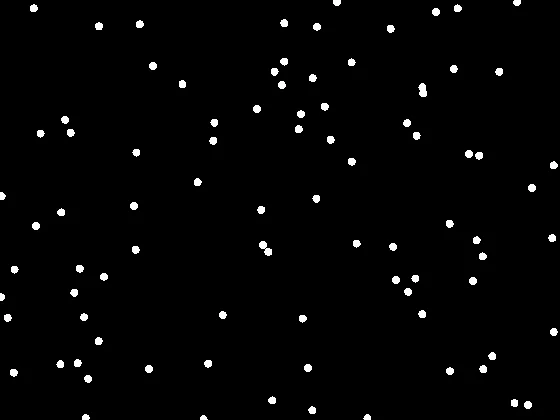

## Résumé

`StarMask` détecte automatiquement les étoiles de l'image active (algorithme DAOFIND de
Stetson, via `photutils.detection.DAOStarFinder`) et construit un **masque binaire** (1 canal)
formé de disques centrés sur chaque étoile détectée. C'est un process **non destructif au sens
strict** : il ne modifie pas l'image source mais **crée une nouvelle fenêtre** contenant le
masque, prête à être appliquée à un autre process pour protéger — ou au contraire cibler —
les étoiles. Le catalogue de détection de la dernière exécution reste accessible via
l'attribut `.stars` de l'instance.

*Le champ source, et le masque que le process en construit.*

## Cas d'usage

- **Protéger les étoiles** pendant un débruitage ou une déconvolution agressive : appliquer le
  masque (éventuellement inversé) sur `NoiseReduction` ou `Deconvolution` pour épargner les
  cœurs stellaires.
- **Cibler uniquement les étoiles** pour un traitement dédié (réduction de halos chromatiques,
  correction ponctuelle) sans toucher le fond de ciel ou les nébulosités.
- **Préparer une entrée pour `StarRemoval`** ou pour une combinaison LRGB/étoiles-nébuleuses en
  isolant géométriquement les régions stellaires.
- **Diagnostiquer la détection** : inspecter `.stars` (table astropy) pour contrôler le nombre
  d'étoiles trouvées et leurs coordonnées avant de pousser plus loin le traitement.

## Fonctionnement

Le traitement se déroule en trois étapes :

1. **Réduction à une luminance 2D** : la moyenne des canaux (`data.mean(axis=2)`) sert de plan
   de détection, quel que soit le nombre de canaux de l'image source.
2. **Détection (DAOFIND)** : les statistiques robustes de fond (médiane, écart-type) sont
   estimées par un sigma-clipping itératif à 3σ (`astropy.stats.sigma_clipped_stats`), puis
   `DAOStarFinder` est lancé sur l'image recentrée (`lum - médiane`) avec un noyau gaussien
   calibré sur `fwhm` et un seuil absolu `threshold_sigma * std`. L'algorithme corrèle l'image
   avec ce noyau, retient les maxima locaux dépassant le seuil, et filtre les faux positifs
   (rayons cosmiques, pixels chauds, sources étendues) via des critères de netteté et de
   rondeur propres à DAOFIND.
3. **Peinture du masque** : pour chaque étoile détectée (centroïde `xcentroid`/`ycentroid`), un
   disque de rayon `radius` est peint à `True` dans un masque booléen de la taille de l'image ;
   le résultat est converti en `float32` et exposé comme image 1 canal dans la fenêtre créée.

## Mathématiques

Soit $L(x,y)$ le plan de luminance et $\tilde{L}$, $\sigma_L$ sa médiane et son écart-type
robustes (sigma-clipping à 3σ). Le seuil de détection est :

$$ t = \texttt{threshold\_sigma} \cdot \sigma_L. $$

DAOFIND corrèle $L - \tilde{L}$ avec un noyau gaussien dont l'écart-type est dérivé de la
largeur à mi-hauteur demandée :

$$ \sigma_{\text{PSF}} = \frac{\texttt{fwhm}}{2\sqrt{2\ln 2}}, \qquad
   K(x,y) = \exp\!\left(-\frac{x^2+y^2}{2\sigma_{\text{PSF}}^2}\right), $$

et retient les positions $(x_0,y_0)$ où la réponse corrélée dépasse $t$ et constitue un maximum
local, sous réserve que les statistiques de forme du pic (netteté, rondeur) correspondent à un
profil ponctuel plausible plutôt qu'à un artefact.

Pour chaque étoile retenue de centre $(c_x, c_y)$, le masque final vaut :

$$ M(x,y) = \bigvee_{i} \mathbb{1}\!\left[(x - c_{x,i})^2 + (y - c_{y,i})^2 \le
   \texttt{radius}^2\right] \in \{0, 1\}, $$

l'union (logique OR) portant sur toutes les étoiles $i$ du catalogue détecté.

## Paramètres

- **`fwhm`** — *real*, défaut `3.0`, plage `1`–`20`. Largeur à mi-hauteur (en pixels) du profil
  gaussien utilisé pour la détection. Doit approcher la FWHM réelle des étoiles de l'image :
  trop petit, il fragmente les étoiles larges en plusieurs détections ou capte du bruit ; trop
  grand, il rate les étoiles fines ou fusionne les étoiles proches.
- **`threshold_sigma`** — *real*, défaut `5.0`, plage `1`–`50`. Seuil de détection, exprimé en
  multiples de l'écart-type robuste du fond. Plus il est élevé, moins d'étoiles faibles sont
  retenues (moins de faux positifs, mais catalogue incomplet).
- **`radius`** — *real*, défaut `4.0`, plage `1`–`50`. Rayon (en pixels) des disques peints
  autour de chaque centroïde détecté. Contrôle l'épaisseur de la protection/ciblage du masque,
  indépendamment de la taille réelle des étoiles.

## Astuces & pièges

> **Attention** — le seuil `threshold_sigma` s'applique à l'écart-type du fond de l'image
> **entière** ; sur un champ à fort gradient (vignettage, pollution lumineuse), le fond n'est
> pas homogène et la détection peut être biaisée. Corrigez le fond au préalable avec
> `BackgroundExtraction` pour une détection plus fiable.

- Le rayon du masque n'a pas besoin d'égaler la FWHM : un `radius` généreux protège aussi les
  ailes du profil stellaire (halo), utile avant un débruitage agressif.
- Une image très bruitée avec `threshold_sigma` trop bas génère de nombreux faux positifs
  (bruit de photon interprété comme des étoiles) : surveillez `.stars` après exécution.
- Le masque est calculé sur la **luminance moyenne** des canaux : sur une image couleur non
  équilibrée (fort déséquilibre R/V/B), la détection peut favoriser le canal dominant.
- Pensez à inverser le masque (`Invert`) si l'objectif est de protéger les étoiles plutôt que
  de les cibler.

## Voir aussi

- [StarAlignment](retina-doc://StarAlignment) — recalage par correspondance d'étoiles.
- [StarRemoval](retina-doc://StarRemoval) — retrait des étoiles par inpainting.
- [DynamicPSF](retina-doc://DynamicPSF) — mesure interactive du profil stellaire (FWHM réelle).
- [SEPSourceExtraction](retina-doc://SEPSourceExtraction) — extraction de sources alternative (SEP).

## Références

- PixInsight — *StarMask* tool reference.
- Stetson, P. B. (1987) — *DAOPHOT: A Computer Program for Crowded-Field Stellar Photometry*, PASP 99.
- photutils.detection — *DAOStarFinder*.
