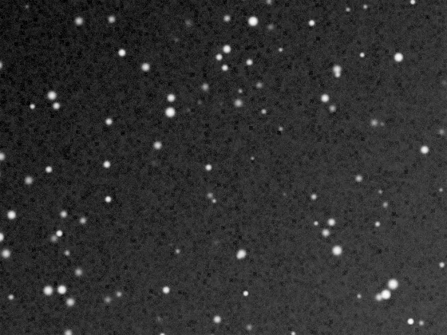

## Résumé

`StarReduction` diminue la taille ou l'éclat apparents des étoiles **sans toucher au reste de
l'image**. Trois méthodes, dans l'esprit de celles que Bill Blanshan a popularisées en
PixelMath — les formules implémentées ici sont les nôtres ; ce qui est repris est le principe.

| Méthode | Ce qu'elle fait | Image starless requise |
|---|---|---|
| `transfer` | Atténue la couche d'étoiles sans la déformer. La plus douce. | oui |
| `halo` | **Érode** la couche d'étoiles : elles rétrécissent au lieu de pâlir. | oui |
| `morphological` | Filtre de minimum sur l'image, mélangé à l'original. | non |

*Avant, et après deux passes morphologiques à 0,6 — sans image starless.*

## Le modèle d'écran, et pourquoi pas une soustraction

Les deux premières méthodes extraient la couche d'étoiles par le **modèle d'écran** :

$$ I = 1 - (1 - L)(1 - S) \quad\Longrightarrow\quad S = 1 - \frac{1 - I}{1 - L} $$

où $I$ est l'image, $L$ l'image sans étoiles et $S$ la couche d'étoiles. Après modification de
$S$, on recompose par la même formule.

Pourquoi pas $S = I - L$ ? Parce que deux sources lumineuses qui se superposent ne s'additionnent
pas linéairement une fois l'image normalisée : une soustraction laisse des **trous noirs** au
cœur des étoiles brillantes, là où l'image sature. Le modèle d'écran, lui, borne naturellement
le résultat et ne creuse rien.

## Obtenir l'image sans étoiles

C'est le travail de [StarRemoval](retina-doc://StarRemoval) : appliquez-le, gardez le résultat
dans une fenêtre, et donnez son identifiant à `starless`. La géométrie doit être identique — le
process refuse plutôt que de recadrer en silence.

Si vous n'avez pas d'image starless sous la main, `morphological` fonctionne tout de suite. Elle
est moins précise : un filtre de minimum mord sur toutes les structures fines, pas seulement
sur les étoiles.

## Paramètres

- **`method`** — *enum* `transfer` | `halo` | `morphological`, défaut `transfer`.
- **`starless`** — *str*. Identifiant de la vue sans étoiles (`transfer` et `halo`).
- **`strength`** — *real*, défaut `0.5`, plage `0`–`1`. Dose l'effet. À `0`, l'image est rendue
  telle quelle.
- **`iterations`** — *int*, défaut `1`, plage `1`–`10`. Nombre d'érosions (`halo` et
  `morphological`). Deux passes rétrécissent nettement plus qu'une.

## Astuces & pièges

> **Réduisez après l'étirement, pas avant.** Sur données linéaires les étoiles occupent
> quelques pixels et la réduction ne se voit pas ; c'est l'étirement qui les fait gonfler.

- `transfer` avec `strength` élevé pâlit les étoiles sans les rétrécir — l'image peut prendre un
  air « sale » si le fond est bruité. Alternez avec `halo`.
- Une image starless imparfaite (résidus d'étoiles) se retrouve dans la couche extraite :
  la réduction sera partielle, pas fausse.
- La méthode `morphological` décale d'un demi-pixel les structures fines à chaque passe. Sur
  deux itérations cela commence à se voir sur une galaxie.

## Voir aussi

- [StarRemoval](retina-doc://StarRemoval) — produire l'image sans étoiles.
- [StarMask](retina-doc://StarMask) — un masque, si vous préférez agir vous-même.
- [MorphologicalTransformation](retina-doc://MorphologicalTransformation) — l'érosion nue, sans
  recomposition.

## Références

- Bill Blanshan — méthodes de réduction d'étoiles en PixelMath (principe repris ici).
