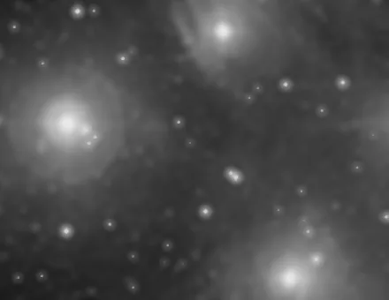

## Summary

`TGVDenoise` denoises the image by minimizing a **second-order Total Generalized Variation
(TGV²)** energy, solved with a **primal-dual** algorithm (Chambolle-Pock). Unlike classic Total
Variation (TV) denoising, which only penalizes the image gradient and produces flat regions
separated by jumps (the "staircasing" artifact), TGV² introduces an auxiliary field that absorbs
**smooth ramps** (continuous brightness gradients, typical of nebulae and star halos) while still
keeping edges sharp. This is a **pure numpy, dependency-free** implementation of the
Bredies-Kunisch-Pock algorithm.

*Before, and after 100 TGV iterations at 0.15: the grain goes, the gradients stay.*

## Use cases

- **Denoise the sky background and faint nebulosity** without crushing subtle brightness gradients
  into artificial flat plateaus (unlike plain TV).
- **Clean a noisy linear image** before stretching, when you need to preserve both fine edges
  (spiral arms, filaments) and smooth transitions (halos, nebula gradients).
- A "patch-tuning-free" alternative to Non-Local Means methods when noise is fairly uniform and
  fidelity to smooth gradients matters more than fine texture.

## How it works

The process handles each channel separately, in float64 for numerical stability of the iterative
scheme. At each iteration of the Chambolle-Pock primal-dual algorithm:

1. **Update the dual variables `p`**: they track the gap between the gradient of the smoothed
   image `u` and an auxiliary field `w`, then are projected onto a ball of radius `α1` (the
   `strength` parameter).
2. **Update the dual variables `q`**: they track the symmetrized gradient of `w` (which captures
   its second-order variation), projected onto a ball of radius `α0 = 2·α1`.
3. **Update the primal variables `u` and `w`**: `u` is pulled toward the original noisy image `f`
   through a proximal operator of the data-fidelity term, weighted by the divergence of `p`; `w`
   absorbs the gradient components that `u` alone cannot represent without creating jumps.
4. **Extrapolation** (`u̅ = 2u - u_old`, etc.), which accelerates convergence of the scheme.

The number of `iterations` sets convergence accuracy: more iterations bring the result closer to
the exact minimum of the TGV² energy, at a proportional computational cost. The gradient/divergence
operators use finite differences with Neumann boundary conditions (frozen edges). The result is
clipped to `[0, 1]`.

## Mathematics

Let $f$ be the noisy image (per channel) and $u$ the sought denoised image. TGV² minimizes the
energy:

$$ \min_{u,\,w} \; \tfrac{1}{2}\lVert u - f \rVert_2^2 \;+\; \alpha_1 \lVert \nabla u - w \rVert_1
\;+\; \alpha_0 \lVert \mathcal{E}(w) \rVert_1 $$

where $w$ is an auxiliary vector field and $\mathcal{E}(w) = \tfrac{1}{2}(\nabla w + \nabla w^{\mathsf T})$
is the **symmetrized gradient** (strain tensor) of $w$, penalizing its second-order variation. The
first term is data fidelity to the noisy image, the second forces $\nabla u$ to stay close to the
smooth field $w$ rather than being penalized directly (which allows nonzero gradients at no cost,
hence no staircasing), and the third regularizes $w$ so it stays smooth itself. The standard ratio
$\alpha_0 = 2\alpha_1$ is used here, following the Bredies-Kunisch-Pock recommendation.

The problem is solved through its **primal-dual** formulation: the $\ell_1$ terms are rewritten as
Legendre-Fenchel transforms, introducing dual variables $p$ (associated with $\nabla u - w$) and
$q$ (associated with $\mathcal{E}(w)$), each projected at every iteration onto a ball of radius
$\alpha_1$, resp. $\alpha_0$:

$$ p \leftarrow \frac{p}{\max\!\big(1,\; \lVert p \rVert_2 / \alpha_1\big)}, \qquad
   q \leftarrow \frac{q}{\max\!\big(1,\; \lVert q \rVert_2 / \alpha_0\big)} $$

Primal and dual step sizes are fixed at $\tau = \sigma = 1/\sqrt{12}$, a value guaranteeing
convergence since $\tau\sigma\lVert L \rVert^2 \le 1$ for the combined linear operator $L$ of the
system (whose norm is bounded by $12$). The primal update of $u$ is an explicit proximal operator
of the quadratic data-fidelity term:

$$ u \leftarrow \frac{u + \tau\,\operatorname{div}(p) + \tau f}{1 + \tau} $$

and the Chambolle-Pock extrapolation ($\bar u = 2u - u_{\text{old}}$) accelerates convergence
toward the saddle point of the energy.

## Parameters

- **`strength`** — *real*, default `0.1`, range `0.001`–`5.0`. Regularization weight `α1` (the
  second-order weight `α0` is derived automatically as `2·α1`). Higher values give stronger
  smoothing (more noise reduction, but risk of blunting fine detail); lower values give a more
  subtle denoise.
- **`iterations`** — *int*, default `100`, range `1`–`2000`. Number of iterations of the
  primal-dual scheme. More iterations means convergence closer to the optimum, at a proportional
  computational cost (the algorithm is pure numpy and does not natively release the GIL).

## Tips & pitfalls

> **Warning** — cost grows linearly with `iterations`, and computation runs in float64 per
> channel: on large images (>20 megapixels) with many iterations, processing time can become
> significant. Start with a moderate `iterations` (50–150) to judge convergence visually before
> increasing it.

- Too high a `strength` can slightly blur the faintest stars: work under a mask (an inverted star
  mask) if you need to protect fine point sources.
- Unlike a Gaussian blur or plain TV, TGV² does not "flatten" brightness gradients: it is the
  method of choice on images with extended nebulosity and smooth transitions (galaxy halos, IFN).
- If the result still looks under-denoised despite a high `strength`, raise `iterations` instead:
  the primal-dual scheme converges slowly at high regularization values.

## See also

- [NonLocalMeansDenoise](retina-doc://NonLocalMeansDenoise) — patch-similarity denoising, better
  for fine texture and faint stars.
- [ACDNR](retina-doc://ACDNR) — fast adaptive smoothing guided by local gradient.
- [WaveletDenoise](retina-doc://WaveletDenoise) — multiscale denoising by wavelet thresholding.
- [NoiseReduction](retina-doc://NoiseReduction) — other generic noise-reduction methods.

## References

- Bredies, K., Kunisch, K., Pock, T. — *Total Generalized Variation*, SIAM Journal on Imaging
  Sciences, 2010.
- Chambolle, A., Pock, T. — *A First-Order Primal-Dual Algorithm for Convex Problems with
  Applications to Imaging*, Journal of Mathematical Imaging and Vision, 2011.
