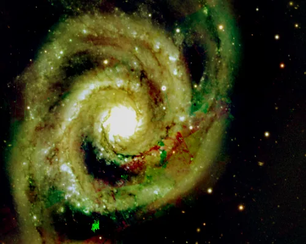
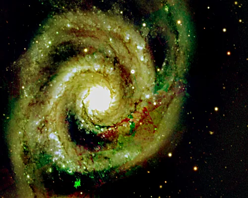

## Summary

`UnsharpMask` sharpens fine image detail by exaggerating local contrast: a blurred copy of the
image is subtracted from the original to isolate the high-frequency content (edges, fine
structure), and that residual, amplified, is added back on top of the original. This is the
historical "unsharp mask" technique inherited from film photography, implemented here via
`skimage.filters.unsharp_mask` on top of a Gaussian blur.

*Before, and after an unsharp mask of radius 2 at 0.8. Local contrast rises; the overall level does not.*

## Use cases

- **Bring out fine structure** in a nebula (filaments, lace-like detail) after stretching,
  without reprocessing the whole image.
- **Increase perceived sharpness** of a slightly soft image coming out of stacking or resampling.
- **Complement a deconvolution**: a light dose of `UnsharpMask` further refines the result after
  `Deconvolution` or `RestorationFilter`.
- **Accentuate planetary/lunar edges** on high local-contrast targets.

## How it works

The operator computes, per channel, a blurred version of the image via a Gaussian convolution of
radius `radius`. The difference between the original image and that blur forms the **mask**:
it contains only high-frequency content (fast variations — edges, fine grain, detail). This mask
is then multiplied by `amount` and added back to the original image, which locally amplifies
contrast wherever the image varies quickly, while leaving flat areas untouched (where the mask is
close to zero). The result is finally clipped to `[0, 1]`.

## Mathematics

Let $I$ be the input image, $r$ = `radius` (the standard deviation $\sigma$ of the Gaussian
kernel used by scikit-image), and $k$ = `amount`. First the blurred image is computed:

$$ B = G_r * I, \qquad G_r(x,y) = \frac{1}{2\pi r^2}\, e^{-\frac{x^2+y^2}{2r^2}} $$

where $*$ is 2D convolution and $G_r$ a normalized Gaussian kernel of parameter $r$. The
**mask** (high-frequency detail) is the difference:

$$ M = I - B $$

and the output is the original image plus the amplified mask:

$$ I' = \operatorname{clip}\big(I + k \cdot M,\; 0,\; 1\big) = \operatorname{clip}\big((1+k)\,I - k\,B,\; 0,\; 1\big). $$

This is a high-pass filter added to the identity: the larger $k$, the more exaggerated the
local contrast; the larger $r$, the broader the enhanced structures (the blur captures
variations at a larger scale, so the mask carries coarser detail). At $k = 0$ the operator is
the identity.

## Parameters

- **`radius`** — *real*, default `2.0`, range `0.1`–`50.0`. Standard deviation (in pixels) of the
  Gaussian blur used to build the mask. A small radius isolates the finest detail (grain, sharp
  edges); a larger radius enhances broader structures (larger-scale local contrast), at the risk
  of producing halos.
- **`amount`** — *real*, default `1.0`, range `0.0`–`10.0`. Amplification factor applied to the
  mask before it is added back to the image. `0` leaves the image unchanged; beyond `1`–`2`, the
  sharpening quickly becomes aggressive and introduces visible noise and halos around
  high-contrast edges.

## Tips & pitfalls

> **Warning** — unsharp masking amplifies **everything** that varies quickly, including noise.
> On a noisy image, reduce noise (`NoiseReduction`, `WaveletDenoise`) *before* applying
> `UnsharpMask`, or work under a star mask to spare the sky background.

- A small `radius` combined with a high `amount` produces the characteristic dark/light halos
  around stars and sharp edges — a sign that one of the two should be reduced.
- Prefer several light passes (moderate `amount`) over one extreme pass: the result looks more
  natural and is easier to control visually.
- On extended, low-contrast targets (diffuse nebulosity), a large `radius` with a moderate
  `amount` gives a gentler local-contrast boost than an aggressive small radius.

## See also

- [GaussianConvolution](retina-doc://GaussianConvolution) — the blur used internally to build the mask.
- [Convolution](retina-doc://Convolution) — general convolution with a custom kernel.
- [Deconvolution](retina-doc://Deconvolution) — sharpness restoration by PSF inversion (complementary).
- [MultiscaleLinearTransform](retina-doc://MultiscaleLinearTransform) — selective per-scale enhancement (wavelets).

## References

- scikit-image — *skimage.filters.unsharp_mask*.
- PixInsight — *UnsharpMask* tool reference.
- Classic unsharp-masking technique (film and digital photography).
