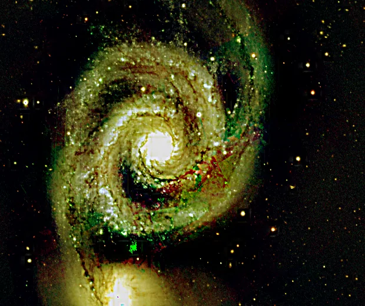

## Summary

`WaveletTransform` decomposes the image into a **2D discrete wavelet transform** (DWT, via
`pywt.wavedec2`) over several scales, then **independently rescales** the approximation
(low frequencies — sky background, overall brightness) and the full set of detail coefficients
(high frequencies — fine structures, noise, edges) before reconstructing the image with the
inverse transform (`pywt.waverec2`). It is a generic multiscale processing tool, complementary to
the à-trous starlet transform in `MultiscaleLinearTransform`, but built on true orthogonal
wavelets (choice of family: Daubechies, Symlets, Coiflets…).

*Before, and after amplifying the detail layers while leaving the approximation alone.*

## Use cases

- **Sharpen fine structures** (nebular filaments, spiral arms) by raising `detail_gain` above 1.
- **Globally soften** grain or residual noise by lowering `detail_gain` below 1, without going
  through a dedicated denoiser.
- **Rebalance background vs. detail** by adjusting `approx_gain` (very-low-frequency background
  brightness) and `detail_gain` (texture) separately.
- **Explore an orthogonal multiscale decomposition** ahead of a more targeted per-band treatment
  (compare against the starlet, which is non-orthogonal but isotropic).

## How it works

For each color channel, processed independently:

1. **Decomposition**: `pywt.wavedec2` applies `level` levels of 2D DWT using the `wavelet`
   filter (`reflect` boundary mode, which extends the image by mirror symmetry to avoid edge
   artifacts). This yields a coarse approximation coefficient `cA_level` and, for each scale
   $j = 1, \dots, \text{level}$, a triplet of details $(cH_j, cV_j, cD_j)$ — horizontal,
   vertical, diagonal.
2. **Per-band gain**: the approximation is multiplied by `approx_gain`, and **all** detail
   coefficients (across every scale and orientation) are multiplied by the same `detail_gain`.
3. **Reconstruction**: `pywt.waverec2` rebuilds the image from the modified coefficients. The
   result may slightly overshoot the original dimensions (internal DWT padding); it is cropped
   back to the source size, then clipped to `[0, 1]`.

A `detail_gain > 1` boosts local contrast (sharpening), a `detail_gain < 1` reduces it
(smoothing); `approx_gain` plays the same role on the very-low-frequency background component.

## Mathematics

The `level`-level 2D DWT decomposes an image $I$ into a hierarchy of subbands obtained by
separable filtering (low-pass $h$, high-pass $g$, tied to the chosen wavelet) followed by
downsampling by 2 at each level:

$$ I \;\longrightarrow\; \big(cA_{L},\; \{cH_j, cV_j, cD_j\}_{j=1}^{L}\big), \qquad L = \texttt{level}, $$

where $cA_L$ is the final approximation (low-pass applied $L$ times) and $cH_j, cV_j, cD_j$ are
the horizontal/vertical/diagonal details of scale $j$ (cross products of low-pass/high-pass
along the two dimensions). The applied transformation is a simple **linear per-band rescaling**:

$$ cA_L' = a \cdot cA_L, \qquad cH_j' = g \cdot cH_j,\; cV_j' = g \cdot cV_j,\; cD_j' = g \cdot cD_j
\quad \forall j, $$

with $a$ = `approx_gain`, $g$ = `detail_gain`. Reconstruction inverts the transform (quadrature
mirror filters, upsampling, then recombination):

$$ I' = \mathrm{DWT}^{-1}\big(cA_L',\, \{cH_j', cV_j', cD_j'\}_{j=1}^{L}\big). $$

For an orthogonal wavelet and all gains equal to 1, this operation is the identity (up to
numerical precision and edge cropping) — which is why only the gains introduce any change to
the image.

## Parameters

- **`wavelet`** — *str*, default `db2`. Name of the PyWavelets wavelet (`db2`, `db4`, `sym4`,
  `coif1`…). Determines the length and shape of the filters, hence the frequency/space
  localization of each band.
- **`level`** — *int*, default `3`, range `1`–`8`. Number of decomposition levels. More levels
  isolate progressively larger structures into the approximation.
- **`approx_gain`** — *real*, default `1.0`, range `0`–`5`. Multiplicative factor applied to the
  approximation coefficient (very-low-frequency background). `1.0` = unchanged.
- **`detail_gain`** — *real*, default `1.0`, range `0`–`5`. Multiplicative factor applied to all
  detail coefficients across every scale. `> 1` sharpens fine structures, `< 1` softens them.

## Tips & pitfalls

> **Warning** — a high `detail_gain` amplifies **noise along with fine signal**: on a noisy
> image, run `WaveletDenoise` first, then apply a modest `detail_gain` for sharpening.

- Unlike the à-trous starlet (`MultiscaleLinearTransform`), the DWT is **subsampled** (decimated):
  it is not translation-invariant, which can introduce very slight blocking artifacts visible at
  strong gain. For processing without this drawback, see `WaveletDenoise` (stationary SWT
  transform).
- The detail gain is **shared across all scales**: for independent scale-by-scale control (like
  PixInsight's ATWT/MMT layers), prefer `MultiscaleLinearTransform` or
  `MultiscaleMedianTransform`.
- The `reflect` boundary mode limits edge artifacts, but a high `level` on a small image can
  still produce visible border effects.

## See also

- [MultiscaleLinearTransform](retina-doc://MultiscaleLinearTransform) — à-trous starlet
  decomposition, with independent per-scale gain.
- [WaveletDenoise](retina-doc://WaveletDenoise) — denoising via stationary wavelets (SWT) with
  soft thresholding.
- [UnsharpMask](retina-doc://UnsharpMask) — sharpening via blur mask, a simple single-level
  alternative.
- [MultiscaleMedianTransform](retina-doc://MultiscaleMedianTransform) — multiscale decomposition
  via successive medians.

## References

- PyWavelets — *pywt.wavedec2* / *pywt.waverec2* (2D discrete wavelet transform).
- Starck, J.-L., Murtagh, F., Fadili, J. — *Sparse Image and Signal Processing: Wavelets and
  Related Geometric Multiscale Analysis*.
